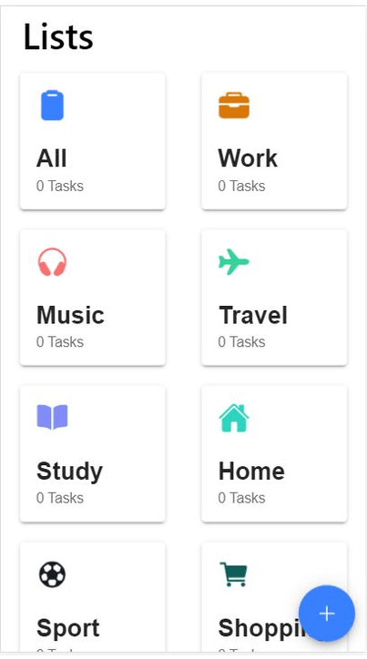

# Todo List App

---

## Info

- Todo app allows users to manage their tasks based on different categories.
- Todo List App is developed using
  - Ionic for supporting cross platform apps
  - Vue3 for SPA
  - Vuex4 for state management
  - Firebase for backend data storage.
  - Tailwind css for styling

---

## App setup and execution

### Installation

- npm install or yarn install
- Create a project in firebase and add the project config details in firebase.ts under "src" directory

### Running in local development server

- npm run serve or yarn run serve

### Deploying in Server

- npm run build or yarn run build
